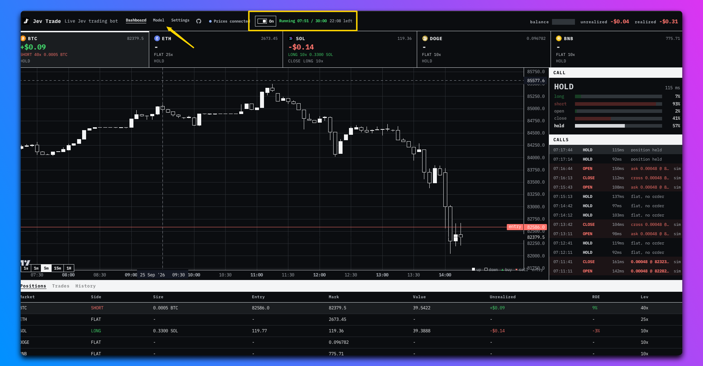

# Jev Trade

[](https://www.jev-trade.com/)
[](LICENSE)

I built a trading bot with Jev. Jev reads the Hyperliquid price feed on every trading tick and decides buy, sell, or hold. The browser applies its answer, using local paper execution or direct wallet-authorized real orders.

**[Open the desk](https://www.jev-trade.com/)**

[](https://www.jev-trade.com/)

Jev makes the call. Hold is an answer, not a skipped tick or a forced trade. BTC, ETH, SOL, DOGE, and BNB share one connected owner's account in real mode. They are not five isolated wallets. Account balances and positions come directly from Hyperliquid.

The browser real-trading path is implemented, but this cutover does not establish a completed Brave Wallet approval or live fill. Those actions, cleanup, and interruption recovery require explicit wallet testing before being reported as verified.

Based on [jev-trader](https://github.com/jarrodwatts/jev-trader) by Jarrod Watts under the MIT license. The venue is Hyperliquid, not Monad or Kuru.

## Ownership

Bun on port 3000 serves only `/health` and `/decide`. It keeps the Jev provider credential, validates address-free inference inputs, and returns decisions. It never receives a wallet key or account address and never submits exchange orders.

The separate Next app in `web/` runs on port 3001 locally. Browser modules own public feeds, charts, paper state, wallet connection, ephemeral agent authorization, account reads, finite runs, and orders. Next is not an exchange proxy. No server Worker, SSE gateway, or operator listener runs visitors' trading sessions.

## How a tick works

1. The browser constructs market features and non-identifying position context from direct Hyperliquid data.
2. Bun asks Jev for a decision and returns it with the originating tick.
3. The browser checks the run, deadline, tick, and market freshness before acting.
4. Entries use post-only `Alo` quotes. Exits use reduce-only `Ioc` orders. Hold does not force a trade.
5. The browser reconciles its own orders and fills directly with Hyperliquid.

Only explicit On starts a finite run. Connecting, authorizing, saving settings, navigating, and reloading do not start or resume trading. Stop cancels this session's owned resting orders where possible; it does not liquidate positions or revoke the venue agent. An awake browser is required. Orders can remain on the venue after a tab closes or sleeps.

## Run locally

Install Bun, just, and fnox with the 1Password CLI for the configured provider secret source. Install the two dependency trees separately through the recipe:

```sh
just install
cp .env.example .env
just dev
```

In another terminal:

```sh
just web
```

Open http://localhost:3001. The root template selects `MODEL=mock` for local development. For Jev decisions, select `MODEL=jev` and supply the chosen provider credential. Production requires Jev. OpenRouter is the default; TypeSafe and Vercel AI Gateway remain supported.

The browser defaults to the page host on port 3000 for inference. To use another API, set an absolute `NEXT_PUBLIC_API_URL` before building web, and allow the dashboard's exact origin in Bun's `WEB_ORIGINS`.

Choose network, markets, paper or real mode, sizing, and finite duration in browser settings. Start with paper. Real mode requires explicit Brave Wallet connection, network preparation, agent approval, and whole-account net-position confirmation. Never add trading private keys to `.env`, Railway, or Next.

## Checks

```sh
just check
just build-web
```

CI separately installs root and web dependencies, runs tests and both typechecks, and builds Next. It does not deploy or verify a live wallet trade.

## Deployment

Both Railway services track `main`; merging is the normal application deploy. `just deploy` is an optional pre-merge upload with production side effects. [`.railway/railway.ts`](.railway/railway.ts) declares the two services without server wallet variables or a data volume. Source changes do not apply infrastructure or delete live resources. See [Deployment](docs/deployment.md) before any infrastructure operation.

## Docs

Start with the [maintainer documentation map](docs/README.md). Changes are recorded in the [changelog](CHANGELOG.md).

## License

MIT. Copyright 2026 aowang. Includes MIT code originally published as jev-trader by Jarrod Watts.
