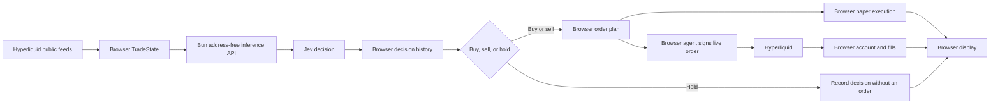

# Architecture

## Runtime split

Issue #24 completes the source cutover to the browser ownership contract introduced in #19 and implemented in #20 through #23.

The repository keeps two separate runtimes:

- Bun runs the address-free Jev inference service from the repository root. It owns the Jev provider credential, model calls, and inference responses.
- Next.js runs the browser app from [`web/`](../web/). Browser code owns settings, public market feeds, paper state, wallet/provider connections, the ephemeral signing agent, account state, run lifecycle, orders, and fills. Next server routes must not become an executor or key store.

The browser sends market features and non-identifying position context to Bun. Wallet addresses, private keys, signatures, provider objects, and session capabilities do not belong in inference requests or responses. Bun does not need an address to ask Jev whether to buy, sell, or hold.

Network signing identity is explicit and independent of transport endpoints. Selecting a custom HTTP or WebSocket URL must not infer or change mainnet/testnet signing identity.

## Startup

Bun starts the inference API and initializes its Jev provider. It does not initialize trading wallets, subscribe to visitor market feeds, create visitor workers, or start trading runs.

The browser initializes its own settings, public feed connections, and paper state. A run starts Off and begins only through browser-owned lifecycle controls. Wallet connection and agent approval belong in the browser; an ephemeral agent key stays in browser memory. Account reads and exchange operations go directly to Hyperliquid, not through Bun.

Stop and expiry end the browser run. Responses arriving after a run stops must not submit orders or revive it. Reloading the page must not resume live execution automatically.

## Modules and ownership

| Module or concern | Owner and responsibility |
| --- | --- |
| [`src/types.ts`](../src/types.ts) and [`web/src/lib/bot-types.ts`](../web/src/lib/bot-types.ts) | Byte-identical inference contracts, including `TradeState`, `ModelDecision`, `JevRequest`, and `JevResponse`. No display, wallet, or account transport types. |
| [`src/model.ts`](../src/model.ts) | Bun Jev questions and answer mapping through the `Model` interface. Provider credentials remain server-side. |
| [`src/server.ts`](../src/server.ts) and [`src/index.ts`](../src/index.ts) | Bun `/health` and `/decide`, with no trading lifecycle or order submission. |
| [`SettingsProvider.tsx`](../web/src/lib/trading/SettingsProvider.tsx) | Persistent browser integration of wallet, session, feed store, settings, and theme across routes. No remote session bootstrap or automatic run start. |
| [`networks.ts`](../web/src/lib/trading/networks.ts) | Explicit signing identity map separate from HTTP and WebSocket endpoints. |
| [`web/src/lib/trading/types.ts`](../web/src/lib/trading/types.ts) | Browser-local display and trading types, separate from the inference contract. Account and wallet data must remain browser-local rather than extending shared inference types. |
| [`feed.ts`](../web/src/lib/trading/feed.ts), [`market.ts`](../web/src/lib/trading/market.ts), and [`trader.ts`](../web/src/lib/trading/trader.ts) | Browser public subscriptions, features, decision ticks, bounded history, and paper execution. |
| [`provider.ts`](../web/src/lib/wallet/provider.ts) and [`agent.ts`](../web/src/lib/wallet/agent.ts) | Direct Brave Wallet connection and ephemeral signing capability. |
| [`account.ts`](../web/src/lib/trading/account.ts), [`exchange.ts`](../web/src/lib/trading/exchange.ts), and [`journal.ts`](../web/src/lib/trading/journal.ts) | Direct account reads, serialized order actions, exact-owned order reconciliation, and fills. |
| [`session.ts`](../web/src/lib/trading/session.ts) and [`locks.ts`](../web/src/lib/trading/locks.ts) | Finite run lifecycle and owner/network exclusion. |

The server executor, visitor Workers, operator listener, and Next session gateway are removed. Do not add compatibility routes or put browser display types back into the shared inference files. The browser modules above are the durable implementation references for #22 and #23.

See [Jev provider](jev-provider.md) for provider configuration. Its credential is distinct from a trading signing key.

## Per-tick flow

Jev makes the buy/sell/hold decision on every trading tick from the price feed. Browser code constructs the inference input and applies the returned intent; it does not replace Jev with an indicator rule or reduce inference to every N ticks. Hold records a completed decision without forcing an order.

Exchange work belongs to a browser-owned serialized order queue. Exchange latency must not block the next inference request. The browser associates each response with its originating run and tick before applying it. Bun returns a decision, never a signed transaction, account snapshot, or order result.

## Runtime cadences

The browser owns the trading-tick lifecycle, price-display cadence, public-feed subscriptions, and disconnected-socket recovery. Bun has no visitor tick scheduler or market-data polling loop.

A price-display refresh is not a Jev decision tick. Public book, trade, candle, and asset-context subscriptions supply market data; startup snapshots and disconnected-socket recovery use public HTTP endpoints. These transport and display cadences must not gate Jev to every N trading ticks. A hold is a model answer, not a skipped tick.

## State and persistence

Browser state includes settings, decision history, recent prices, chart points, feed buffers, paper positions and balances, pending orders, fills, account snapshots, and run lifecycle. Keep bounded histories and buffers in the browser. Paper state is local simulation, not a Bun session.

Persist only explicitly supported non-secret preferences or paper state in browser storage. Wallet/provider connections, agent private keys, and live execution authority are not persistent settings. Keep ephemeral keys in memory, discard them when their browser lifecycle ends, and require a fresh connection/approval flow when needed. Reload must not silently re-arm a live run. Hyperliquid remains the source of truth for live account state, open orders, and fills.

Bun must not persist or retain visitor settings, paper balances, wallet identities, agent keys, account state, orders, fills, or run capabilities. Request-local inference context is not a visitor session. Restarting Bun must not create or restore a trading executor, and there is no worker registry whose lifetime controls browser trading state.
