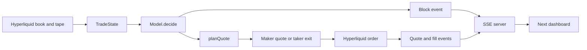

# Architecture

## Runtime split

The repository contains two processes:

- The bot runs on Bun from the repository root. It owns credentials, market data, Jev calls, account state, and Hyperliquid orders.
- The dashboard runs on Next.js from [`web/`](../web/). It receives public JSON and SSE data from the bot. It does not import bot runtime code or hold trading credentials.

This boundary is intentional. Trading and secrets stay in the Bun process, while the dashboard remains a live Next app.

## Startup

[`src/index.ts`](../src/index.ts) creates one reusable execution runtime for the shared executor, registers every configured sleeve, and prepares sleeves serially to avoid a burst of Hyperliquid HTTP requests. Immutable symbol and leverage metadata is fetched once and shared across its sleeves. A successful sleeve becomes live immediately. A failed sleeve remains registered as retrying and retries independently after 30 minutes without restarting healthy sleeves.

The HTTP and SSE server starts before shared sleeve initialization. In shared paper mode, startup arms one timed run after settings are applied and starts it when the first sleeve is ready. Shared real mode remains Off until a private operator starts it. Expiry or manual Stop never starts another shared run.

The same bot process owns a registry of isolated visitor sessions. Creating a session starts a keyless paper execution runtime in its own Bun Worker and loopback HTTP server. That Worker starts Off. The registry authenticates each nested session request with its opaque capability, proxies it only to the matching Worker, and disposes idle Workers. The shared executor and visitor Workers reuse the runtime and serializers but do not share lifecycle, settings, history, or trades.

## Bot modules

| File | Responsibility |
| --- | --- |
| [`src/types.ts`](../src/types.ts) | Shared HTTP and SSE wire types. |
| [`src/config.ts`](../src/config.ts) | Environment parsing, defaults, provider selection, safety flags, and timing values. |
| [`src/sleeves.ts`](../src/sleeves.ts) | Coin list and wallet assignment for each sleeve. |
| [`src/market.ts`](../src/market.ts) | Hyperliquid account access, leverage, orders, fills, and dry-run behavior. |
| [`src/book.ts`](../src/book.ts) | L2 book normalization, depth metrics, and maker or taker price calculation. |
| [`src/feed.ts`](../src/feed.ts) | Hyperliquid HTTP snapshots, WebSocket subscriptions, trade tape, and timers. |
| [`src/trades.ts`](../src/trades.ts) | Trade and fill buffers, summaries, and simulated fill matching. |
| [`src/chart.ts`](../src/chart.ts) | Venue candles, one-second mids, fill markers, and chart history. |
| [`src/indicators.ts`](../src/indicators.ts) | Indicators and venue features passed to the model. They do not gate trades. |
| [`src/snapshot.ts`](../src/snapshot.ts) | History and tape clipping for API responses. |
| [`src/account.ts`](../src/account.ts) | Clearinghouse state conversion and realized PnL and fee accounting. |
| [`src/plan.ts`](../src/plan.ts) | Intent normalization, leverage rungs, and conversion to one order plan. |
| [`src/model.ts`](../src/model.ts) | `TradeState`, Jev questions and answer mapping, plus real and mock models. |
| [`src/trader.ts`](../src/trader.ts) | Per-tick decision loop, order queue, simulated positions, totals, and events. |
| [`src/server.ts`](../src/server.ts) | Bun HTTP server, snapshots, history, tape, and SSE broadcasts. |
| [`src/index.ts`](../src/index.ts) | Process composition, sleeve lifecycle wiring, and logging. |
| [`src/execution-runtime.ts`](../src/execution-runtime.ts) | Reusable executor assembly for the shared bot and isolated visitor Workers. |
| [`src/paper-sessions.ts`](../src/paper-sessions.ts) | In-memory visitor registry, capability routing, capacity, rate, body, stream, and idle limits. |
| [`src/paper-session-worker.ts`](../src/paper-session-worker.ts) | Keyless visitor runtime with explicitly injected environment before runtime imports. |
| [`src/paper-session-guard.ts`](../src/paper-session-guard.ts) | Paper-only, official-endpoint, credential-free visitor request restrictions. |

The Jev provider is behind the `Model` interface in [`src/model.ts`](../src/model.ts). See [Jev provider](jev-provider.md) for provider configuration.

## Per-tick flow

`Trader.onBlock()` reads the latest book, harvests fills, builds `TradeState`, and awaits one model decision. It emits the block event before exchange I/O. Leverage updates and orders run on a serialized background promise so exchange latency does not hold the next model call. If a model call still occupies the next tick, that tick is marked late rather than starting a second call.

## Runtime cadences

| Setting | Default | Work performed |
| --- | ---: | --- |
| `TICK_MS` | 30000 ms | Advances the local tick, summarizes book and tape state, asks the model, emits a block event, and queues the resulting order action. |
| `PRICE_MS` | 1000 ms | Emits a price event when the mid changes and adds live mids to chart data. It does not make a Hyperliquid request, ask the model, or place an order. |
| `HL_FALLBACK_POLL_MS` | 30000 ms | While the WebSocket is disconnected, refreshes the book, recent trades, and asset context over HTTP. It performs no recurring HTTP work while the socket is healthy. |

Book WebSocket messages may trigger either local cadence when its interval has elapsed. A timer also checks the decision cadence, so a quiet book can still produce ticks. Hyperliquid book, trade, candle, and asset-context subscriptions are the primary market-data path. HTTP supplies startup snapshots and disconnected-socket recovery.

## State and persistence

Shared trading state is process memory: `Trader.history`, recent mids, pending orders, simulated positions, totals, feed trade buffers, chart points, connected SSE clients, and the snapshot cache. History is capped by `historySize`, currently 1,000 block events per sleeve. Feed and chart buffers have their own caps.

The visitor registry and every visitor runtime also live only in bot process memory. Each visitor owns a separate Worker, execution runtime, market connections, settings, run lifecycle, and buffers. The default registry holds at most 8 sessions and expires a session after 10 minutes without a request. This isolation has real memory, connection, and model-inference cost, so the limits are part of the runtime design. The bot service must stay at one replica because the registry is not shared across processes.

The bot does not persist this state to a database or local runtime file. A bot restart loses all visitor capabilities and sessions. Visitors must Reconnect and begin with a new Off worker. The shared executor reloads venue candles, user fills, and clearinghouse state. For live sleeves it fetches existing open orders for the coin and cancels only its own orders. The optional `.wallets.json` file is configuration, not trading-state persistence.
