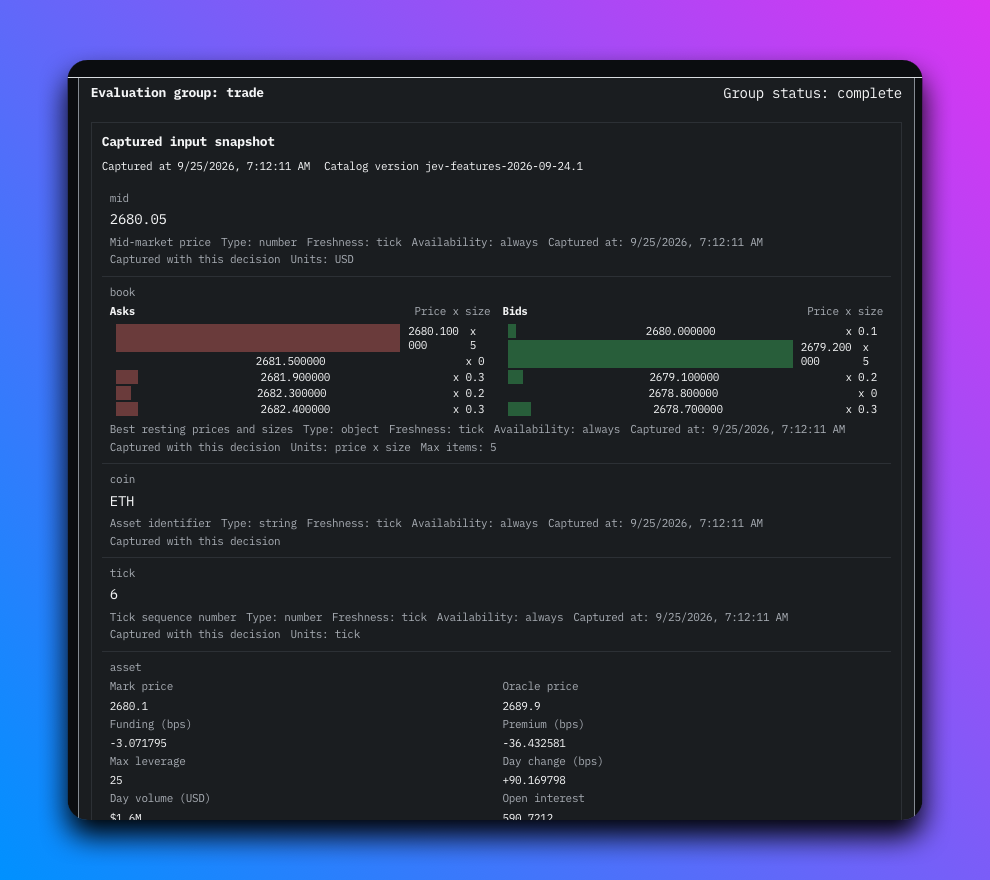

# Dashboard

The dashboard is a separate Next.js App Router application in [`web/`](../web/). The public view reads market data and run status from Bun. It does not receive wallet keys, Jev credentials, or transport API keys.

## Routes and shared state

[`web/src/app/page.tsx`](../web/src/app/page.tsx) renders the market dashboard. [`web/src/app/settings/page.tsx`](../web/src/app/settings/page.tsx) renders the non-indexed settings page. [`SettingsProvider`](../web/src/lib/trading/SettingsProvider.tsx) sits above both routes, so navigation does not create another market feed or reset a run display.

The Header separates two facts:

- `Prices connected`, `connecting`, or `reconnecting` reports the public SSE connection.
- `Off`, `Starting`, `Running`, `Stopping`, `Expired`, or `Attention required` reports the authoritative Bun run.

A connected price stream does not mean trading is running. The old green Live meaning no longer controls trading. Green run styling appears only while the lifecycle reports `running`.

The run display derives elapsed and remaining time from Bun's `startedAt`, `deadlineAt`, `stoppedAt`, `durationMs`, and `serverNow`. React's interval only refreshes the display. It does not enforce or extend the deadline. A refresh resumes the same visitor Worker through its cookie and never sends Start.

## Asset sleeves

Each sleeve card in [`SleeveStrip`](../web/src/components/SleeveStrip/SleeveStrip.tsx) shows the coin, unrealized PnL, position, latest call, the price as `$1,234.56` (more decimals below $1) with the trading pair from `SleeveMeta.pair` under it, and a mini chart of the newest 120 tape prints. A metrics row is computed in the browser by [`sleeve-metrics.ts`](../web/src/lib/sleeve-metrics.ts) from events already received: time in the current position, time since Jev's last call, the share of decisions that sent an order, the share of orders that filled, and average Jev response time. The selected sleeve and the right rail use that coin's brand color as an accent.

## Recent Decisions and History panes

The right rail has two panes. Recent Decisions ([`DecisionPanel`](../web/src/components/DecisionPanel/DecisionPanel.tsx)) shows Jev's latest call and a breakdown of the newest 100 decisions the page holds for the selected sleeve, with the count and the time span they cover in the rail header. [`decision-summary.ts`](../web/src/lib/decision-summary.ts) puts each decision in exactly one category (open long, open short, close, hold, late), so the shares always sum to 100%. Clicking the chart switches between bars and a pie. The legend items show each category's count, a definition on hover, and the same definition inline on click.

History ([`Feed`](../web/src/components/Feed/Feed.tsx)) lists recent calls. Clicking a row replaces the pane with a condensed detail view of that decision: block, latency, prices, Jev's confidence per answer, the order, fill, transaction, and position, with a link to the full record on `/model`. BACK returns to the list. The detail view takes over the pane instead of opening a popup so the chart and book stay visible.

## Operator and visitor views

Remote visitors get an isolated, keyless paper executor. The page creates one server-side Bun Worker, then uses that worker for its feed, settings, run lifecycle, history, and tape. Save, Start, and Stop affect only that visitor's worker. They never mutate the shared demo or its wallet-backed executor.

The visitor flow starts Off:

1. Open Settings and choose the official mainnet or testnet feed, assets, duration, and paper controls.
2. Save applies the complete draft to the visitor worker. Reset restores defaults to the draft, so Save is still required.
3. Start begins a fresh timed paper run. Stop ends it through the normal cleanup path.

Visitor sessions cannot select real mode, enter wallet or transport credentials, or use custom HTTP, WebSocket, or RPC destinations. Their decision cadence cannot be less than 30 seconds. A visitor run uses the bot's configured model provider, so inference consumes the bot deployment's model allowance. Each session also consumes one Worker, its market connections, and memory until the session closes or expires.

The visitor capability stays in an HttpOnly, SameSite=Strict cookie scoped to `/api/session`; production cookies are also Secure. Browser code talks only to the same-origin Next gateway and never receives the capability. Refresh resumes the same worker, including its applied settings and run. If the session is deleted, expires, or disappears during a bot restart, the UI stops and shows Reconnect instead of creating another session automatically. Reconnect creates a fresh Off worker with defaults and fresh execution state. With durable storage enabled, a separate signed HttpOnly owner cookie restores the database owner so the new session can read prior decisions. That owner cookie never authorizes reads. The new active capability does.

The operator switch remains available only when a localhost page can reach the private loopback control API. On localhost, the browser defaults to `http://127.0.0.1:3002`. A non-local page uses visitor scope. `NEXT_PUBLIC_OPERATOR_API_URL` is only routing and adds no authentication, so it must point to a deliberately protected local channel, never a public reverse proxy.

Shared paper mode still arms one configured-duration run at process startup and starts when the first sleeve is ready. Expiry and manual Off do not start another run; a process restart creates a new paper run. Shared real mode starts Off, requires a private confirmed Start, and is unavailable to visitors. No Brave Wallet connection is required for the local server-wallet operator path.

The switch shows the configured limit while Off, 30 minutes by default. An active run shows only the time left; elapsed time is in the tooltip. Manual Off and expiry use the same owned-order cleanup path. Stop does not liquidate positions. `Attention required` blocks another start and locks execution settings. A visitor sees Reset paper run; the local operator sees Retry cleanup. Either action reconciles cleanup and unlocks the form only after it succeeds.

## Top row

[`Header`](../web/src/components/Header/Header.tsx) reads the site name, slogan, logo, menu items, and icon links from [`web/src/site.config.json`](../web/src/site.config.json), validated by [`site-config.ts`](../web/src/lib/site-config.ts). Menu links are site paths or https URLs; icon links are https URLs with a `kind` of `github`, `x`, `discord`, `telegram`, `youtube`, or `link`. Adding an icon kind means adding its SVG path to [`SiteIcon.tsx`](../web/src/components/Header/SiteIcon.tsx). Rendered text rejects middle dots and en or em dashes.

The Settings Top row tab shows these values and the logo's dimensions to everyone. Under `next dev` on localhost the tab can edit them and writes the JSON file through `POST /api/site-config`; that route returns 404 in production builds. Commit and merge the file to change the live site.

The run switch sits at the right end of the top row after the balance. It shows only one clock: time left while a run is active, or the run limit while Off. Elapsed time is in the tooltip.

## Settings page

The page has four tabs:

- Trading contains network, mode, assets, execution-only controls, and run limits.
- Jev model shows the legacy prompt label `jev-trade-2026-09-23.1`, its questions and input catalog, and edits `tickMs` and `horizonBlocks`. The active versioned program revision is recorded in decision history. See the [Jev model contract](jev-model.md) for detailed field definitions.
- Connections contains official visitor connection checks or the local operator transport controls.
- Top row shows and, on a local dev server, edits the site branding described above.

Execution-only values remain labeled as execution controls. They are not presented as Jev inputs.

The form separates drafts from applied settings. Save validates and applies one complete snapshot to the selected executor. Cancel restores applied values without making a request. Reset changes the draft to defaults, and Save is still required. Trading and connection fields are disabled during Starting, Running, Paused, Stopping, and Attention required. Theme remains editable.

Theme uses `jev-trade:theme:v1`. The first visit follows the system preference. An explicit light or dark choice updates the whole app and browser theme color. Browser settings are network-scoped preferences, not durable visitor execution state. API keys, RPC URLs, and credential-bearing endpoint paths or queries remain memory-only in local operator scope.

Debug mode uses `jev-trade:debug:v1` and is on by default. The toggle sits in the Appearance section next to the theme controls. In the visitor scope it opens a same-origin EventSource on `GET /api/session/logs`, which the gateway proxies to the visitor worker's loopback console stream using the same unbuffered streaming path as events. Each bot console line appears in the browser console with a `[jev]` prefix, replaying buffered lines after `Last-Event-ID` on reconnect. The subscription opens only while a visitor session is connected; the local operator scope has no logs stream. Toggling the preference takes effect without a reload.

Decision-history reads use same-origin `GET /api/session/decisions?limit=&before=`. The Next gateway forwards the active capability to the bot and returns only the database owner resolved for that capability. Pages are newest first and contain `decisionId`, `createdAt`, `updatedAt`, `decision`, `recordType`, `evidence`, `observations`, `programMetadata`, `quote`, `fills`, and `markouts`. The `/model` page presents this history; see [Model page](#model-page).

## Model page

The `/model` page is linked from the primary navigation between Dashboard and Settings. Its first view, Decisions, is a read-only browser of the owner-scoped decision journal. It reads only through same-origin `GET /api/session/decisions?limit=&before=`; the server resolves the owner from the session capability. It does not use the live feed reducer or SSE and creates no market subscription. Navigating to this page does not restart runs or reset the browser session.

The page loads newest-first bounded pages of 50 rows and uses the opaque `before` cursor to load older history. Refresh reloads history. Loading, empty, error, expired-session, and end-of-history states are shown. Appending older pages preserves the selected decision.

The detail panel has three sections:

- Model evidence groups questions by stable question key under each evaluation group, with required-role questions separated from observational questions. Typed answers show their recorded confidence and probability distributions as labeled bars, with the selected criterion marked. Instructions and criteria render as key/value rows and chips rather than raw JSON. Each evaluation group has one immutable input snapshot with feature freshness, stale, or missing metadata; venue market data renders as labeled rows and order-book depth as a two-sided price-by-size ladder. Long revisions truncate to an expandable chip, and any remaining large stored value collapses behind an expand toggle.
- Execution shows the recorded quote and correlated fills. Missing data is shown as unavailable, never inferred.
- Outcome shows closed PnL and 1, 5, 20, and 100 tick markouts with market return and bias-signed return. A hold with no order is still a completed decision.

Legacy rows remain readable. When program fields were not persisted, the page shows `Program metadata unavailable for this record.`

## Feed lifecycle

[`useFeed()`](../web/src/lib/useFeed.ts) first fetches `GET /snapshot` and opens `/events?lite=1`. The lite stream sends `ready` instead of another snapshot. The hook later fetches `/tape` for deeper chart history.

A 45-second event gap reconnects the stream. Before the first snapshot, the timeout is 90 seconds. Retry delay starts at one second and caps at ten seconds. `ping` events keep the connection active. Run state is polled every two seconds through the active scope, and operator state is polled every five seconds.

Every configured sleeve remains visible if initialization fails. Paper startup failures remain Off and retry until the first ready sleeve starts the single armed run. During that run, healthy sleeves continue independently and a recovered sleeve joins only while it remains active. An unavailable sleeve produces no fabricated decisions, and recovery cannot restart an expired or manually stopped run. Real-mode recovery only prepares resources while Off.

## Shared wire types

[`src/types.ts`](../src/types.ts) is canonical for the market feed. [`web/src/lib/bot-types.ts`](../web/src/lib/bot-types.ts) is its byte-for-byte dashboard copy. Settings and lifecycle contracts likewise have Bun and web copies because the dashboard build does not import root source files.

## API URLs and local development

`NEXT_PUBLIC_API_URL` selects the browser-visible shared Bun API. The server-side visitor gateway uses `BOT_API_URL` when set and otherwise falls back to `NEXT_PUBLIC_API_URL`. When `NEXT_PUBLIC_API_URL` is unset in local development, the browser uses its page hostname on port 3000. `NEXT_PUBLIC_OPERATOR_API_URL` selects the private control API only when explicitly set; localhost pages otherwise use `127.0.0.1:3002`.

Run Bun on port 3000 and the dashboard on port 3001. The private operator listener starts with Bun on loopback port 3002. Its default accepted origin is `http://localhost:3001`, so use that exact dashboard URL unless the control origin is configured to another explicit loopback origin.

Rendered text must not contain middle dots, em dashes, or en dashes. Do not add blinking or pulsing indicators.
